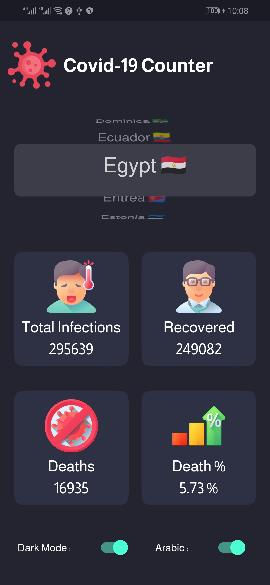

# Corona Counter Flutter App

This app was one of my first apps built using flutter and provider for state management 
it connects to the [Covid-19 Api](https://rapidapi.com/api-sports/api/covid-193/)
gets the data for that country and save it in the Shared preferences , it also handles offline state and caching data for one day before reloading it to reserve api data . 

## what I've learned

 1. making custom ui for app in flutter with light and dark themes 
 2. how to make multilanguage flutter app using [Easy Localization](https://pub.dev/packages/easy_localization) plugin 
 3. how to make theme switcher with realtime dark/light mode switch with [Provider](https://pub.dev/packages/provider)
 4. handling connection errors and offline state all over the app using [Connectivity](https://pub.dev/packages/connectivity)
 5. foundamentals of how to [document](https://dart.dev/guides/language/effective-dart/documentation) and [test](https://dart.dev/guides/testing) my app 

this app was indented for training purposes only not for production ready environment ,, so all the code is open source and you can event download the apk from [apkpure.com](https://apkpure.com/p/com.invign.corona)